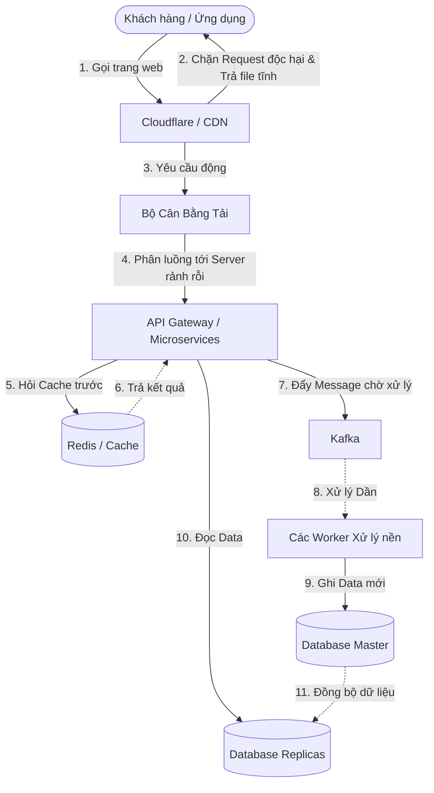

# Kiến Trúc Dữ bản Các Hệ Thống Lớn (Facebook)

## Sơ Đồ Khối 

```mermaid
graph TD
    User([Khách hàng / Ứng dụng]) -->|1. Gọi trang web| CDN[Cloudflare / CDN]
    CDN -->|2. Chặn Request độc hại & Trả file tĩnh| User
    CDN -->|3. Yêu cầu động| LB[Bộ Cân Bằng Tải]
    LB -->|4. Phân luồng tới Server rảnh rỗi| Gateway[API Gateway / Microservices]
    
    Gateway -->|5. Hỏi Cache trước| Cache[(Redis / Cache)]
    Cache -.->|6. Trả kết quả | Gateway
    
    Gateway -->|7. Đẩy Message chờ xử lý| Kafka[Kafka]
    Kafka -.->|8. Xử lý Dần| Worker[Các Worker Xử lý nền]
    
    Worker -->|9. Ghi Data mới| DBMaster[(Database Master)]
    Gateway -->|10. Đọc Data| DBReplica[(Database Replicas)]
    
    DBMaster -.->|11. Đồng bộ dữ liệu| DBReplica
```

