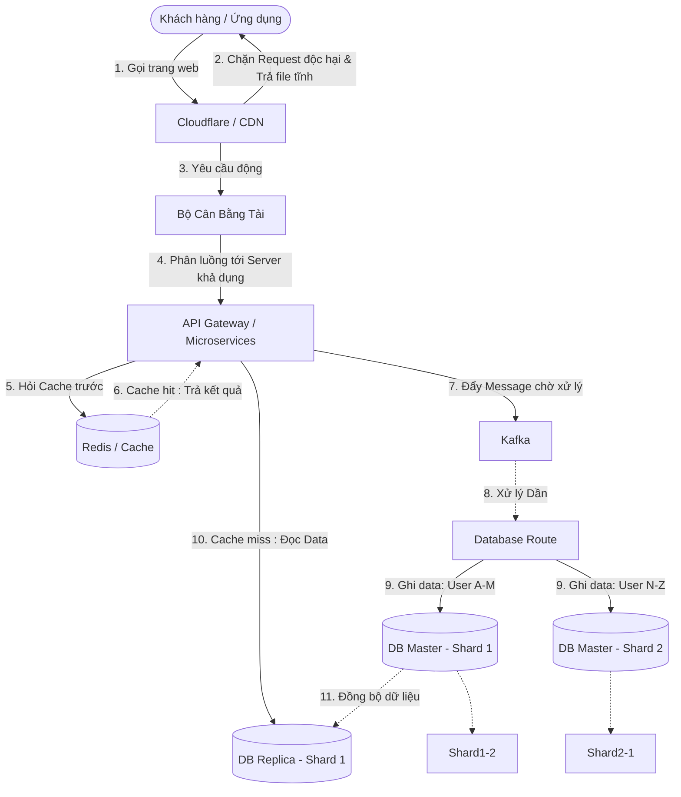

# Kiến Trúc Dữ Liệu Các Hệ Thống Lớn (Facebook)

## Sơ Đồ Khối 

```mermaid
graph TD
    User([Khách hàng / Ứng dụng]) -->|1. Gọi trang web| CDN[Cloudflare / CDN]
    CDN -->|2. Chặn Request độc hại & Trả file tĩnh| User
    CDN -->|3. Yêu cầu động| LB[Bộ Cân Bằng Tải]
    LB -->|4. Phân luồng tới Server khả dụng| Gateway[API Gateway / Microservices]
    
    Gateway -->|5. Hỏi Cache trước| Cache[(Redis / Cache)]
    Cache -.->|6. Cache hit : Trả kết quả | Gateway
    
    Gateway -->|7. Đẩy Message chờ xử lý| Kafka[Kafka]
    Kafka -.->|8. Xử lý Dần| Worker[Database Route]

    Worker -->|9. Ghi data: User A-M| Shard1Master[(DB Master - Shard 1)]
    Worker -->|9. Ghi data: User N-Z| Shard2Master[(DB Master - Shard 2)]
    
    Gateway -->|10. Cache miss : Đọc Data| Shard1Replica[(DB Replica - Shard 1)]
    
    
    Shard1Master -.->|11. Đồng bộ dữ liệu| Shard1Replica
    Shard1Master -.-> Shard1-2
    Shard2Master -.-> Shard2-1
```

