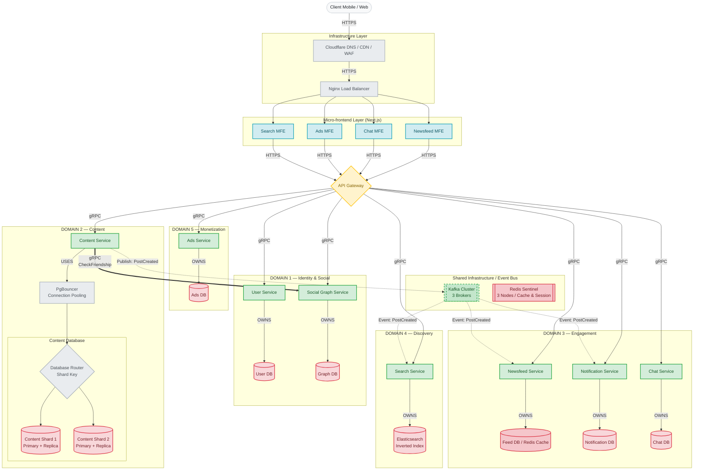
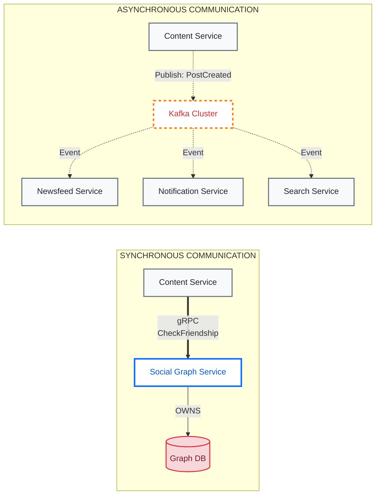
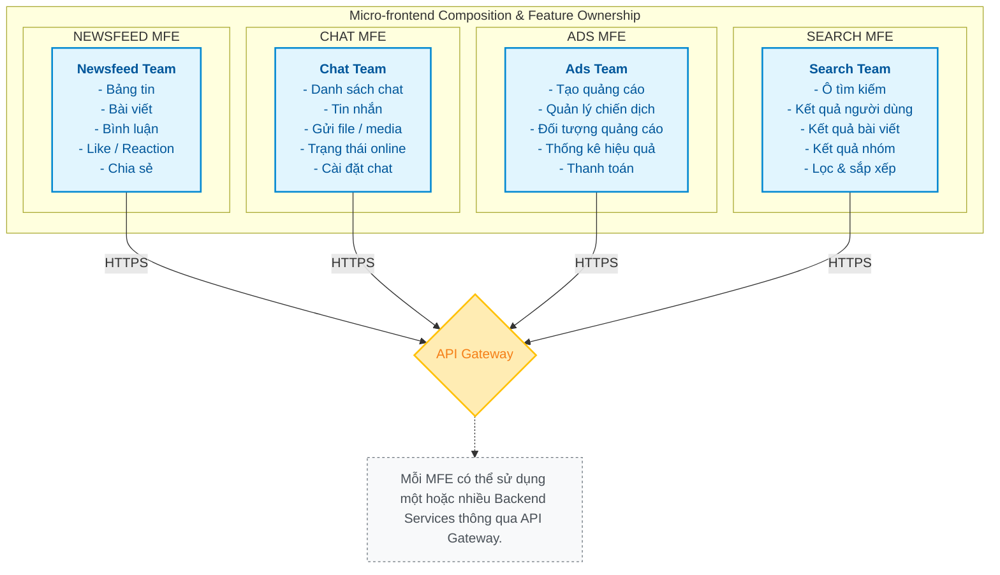

# Kiến Trúc Hệ Thống Mạng Xã Hội

---

## TASK 1 — Architecture Ownership & Communication Diagram

---

## TASK 2 — Service Communication Diagram

**Synchronous (gRPC)** và **Asynchronous (EDA / Event)**.

### Communication Matrix

| Caller | Callee | Method/Event | Communication | Reason |
|---|---|---|---|---|
| API Gateway | User Service | User APIs | gRPC | Synchronous request |
| API Gateway | Content Service | Content APIs | gRPC | Synchronous request |
| Content Service | Social Graph Service | `CheckFriendship()` | gRPC | Immediate response |
| Content Service | Kafka | `PostCreated` | EDA | Asynchronous event |
| Kafka | Newsfeed Service | `PostCreated` | EDA | Update feed |
| Kafka | Notification Service | `PostCreated` | EDA | Create notification |
| Kafka | Search Service | `PostCreated` | EDA | Update search index |

---

## TASK 3 — Micro-frontend Detail

