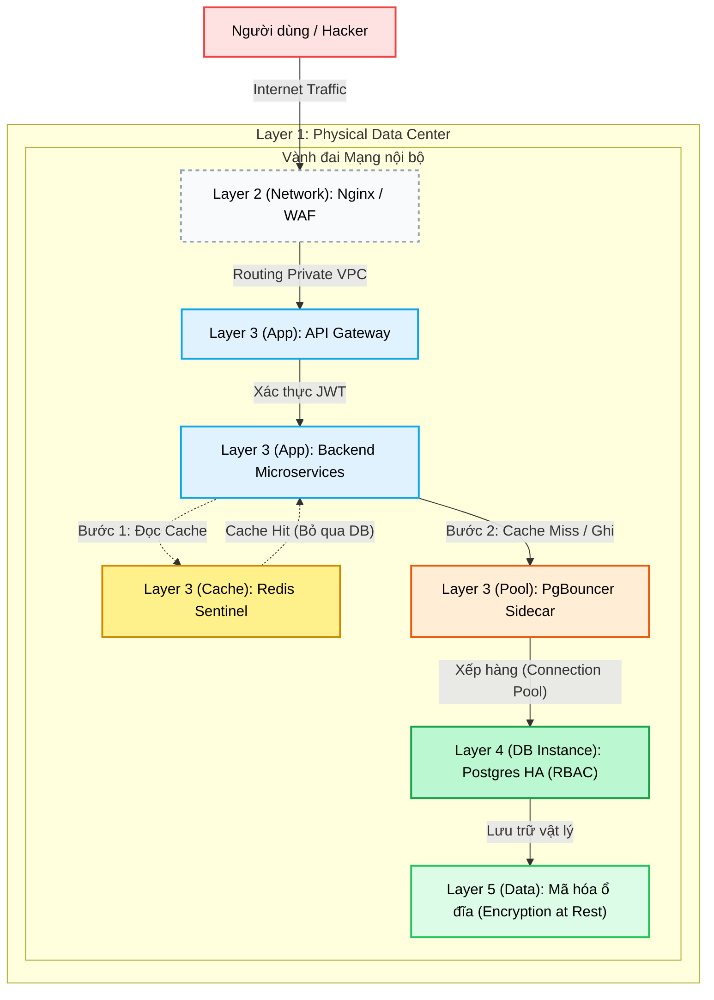

# Mô hình database Shoppee qua các lớp bảo vệ

---

## 1. Defense-in-Depth Topology

---

## 2. Ý nghĩa của các lớp bảo vệ

### Lớp 1: Physical Security (Bảo mật cốt lõi hạ tầng)
*Bảo vệ hệ thống trước sự cố trộm cắp vật lý, cháy nổ, phá hoại.*
- Máy chủ vật lý chứa Database phải đạt chuẩn hệ sinh thái đám mây quốc tế như AWS Tier 3. Toàn bộ khu vực được bao quát bởi Camera an ninh, yêu cầu xác thực nhận diện sinh trắc học và hệ thống phòng cháy chữa cháy an toàn. Môi trường đặt Server tách rời tuyệt đối với các khu vực tự do.

### Lớp 2: Network Security (Bảo mật Tầng Biên Mạng)
*Vành đai thép bảo vệ server khỏi Thế giới Internet.*
- **Chống DDoS và Quét cổng:** Đặt Nginx hoặc Cloudflare ở biên mạng ngoài cùng để làm màng lọc đánh bay các truy vấn bất chính.
- **Phân tách mạng VPC:** Postgres và Redis tuyệt đối Không dùng Public IP và Không mở lộ Port kết nối ra thế giới. Database cấu hình chỉ được phép nghe và trả lời truy vấn từ dải IP nội tâm nằm trong Private Subnet của mạng ứng dụng Backend.

### Lớp 3: Application & Host Security (Lớp Khiên Kiến Trúc Ứng Dụng)
*Chặn đứng SQL Injection và chống ngập lụt hệ thống.*
- **Application Logic:** Ở điểm chạm đầu tiên, mọi luồng giao tiếp phải cung cấp chuỗi JWT hợp lệ cho API Gateway. Đi sâu vào Backend Microservices, các truy vấn sẽ được làm sạch bằng công cụ cầu nối cơ sở dữ liệu ORM, từ đó loại bỏ hoàn toàn các mã lệnh SQL Injection độc hại trước khi tiến tới Database.
- **Xả tải & Giảm xung chấn:**
  - **Redis Cache:** Tạo trạm chờ bảo vệ Database không chìm trong biển truy cập bằng việc đáp ứng sẵn dữ liệu thường xuyên cập nhật.
  - **PgBouncer:** Đóng vai trò kiểm soát luồng. Khi các server NextJS tự động nhân bản, số lượng kết nối gửi về Database sẽ ồ ạt. PgBouncer giúp gom nhóm các kết nối phân tán này theo hàng đợi nhằm ngăn Postgres không sụp đổ vì cạn kiệt tài nguyên luồng kết nối.

### Lớp 4: Database Instance (Bảo mật Quản Trị Hệ Thống DB)
*Kiểm duyệt chặt chẽ ngay cửa phòng kho chứa dữ liệu.*
- **Phân quyền RBAC:** Phân mảnh quản trị nội bộ theo khái niệm Đặc Quyền Tối Thiểu. Ứng dụng Auth Service chỉ dùng một tài khoản chỉ định để đọc riêng rẽ bảng Thông tin người dùng. Nếu tin tặc chiếm quyền điều khiển của hệ thống Sản phẩm, chúng không thể lợi dụng tài khoản nội bộ đó để truy xuất sang bảng Người dùng.
- **Auditing & Monitoring:** Kích hoạt chức năng của Postgres để giám sát tự động các câu lệnh truy vấn bất minh, liên tục cảnh báo lượng đăng nhập thất bại giúp phát hiện nhanh các dấu hiệu tấn công.

### Lớp 5: Data Security (Lõi Bảo Mật Dữ Liệu Thực)
*Bảo vệ ở điểm cuối của đĩa cứng.*
- Mục tiêu tối thượng của mã hoá là đề phòng kịch bản tin tặc tháo dỡ toàn bộ dàn ổ cứng vật lý ra cũng không thể nào đọc hiểu mã lõi.
- **Mã hoá ổ cứng:** Mã hóa bảo mật trực tiếp ở cấp độ cấu trúc logic của đĩa lưu trữ.
- **Mã hoá trường Dữ liệu:** Mật khẩu đăng nhập hay mã thẻ tín dụng của khách hàng được băm một chiều và tiếp tục mã hoá dưới dạng chuỗi ngay từ trên bề mặt Backend code trước khi dội xuống hệ quản trị Database.
- **Sao lưu:** Thiết lập các chốt sao lưu hệ thống bản ghi Database định kỳ tự động, chuyển vị trí dữ liệu về các kho lưu trữ đông lạnh để khôi phục nhanh mọi tổn thất trong ngày định mệnh.
