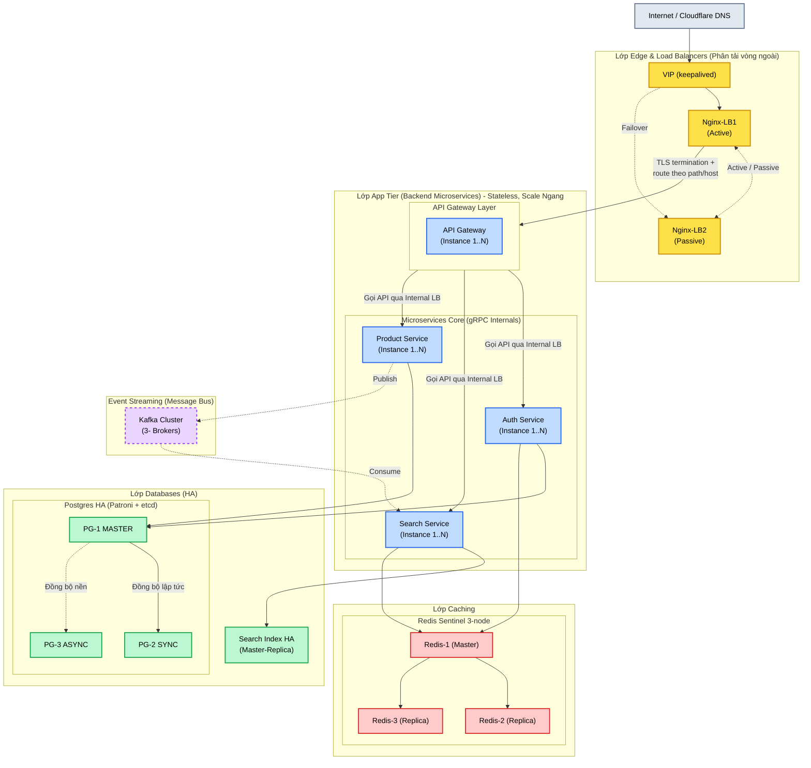
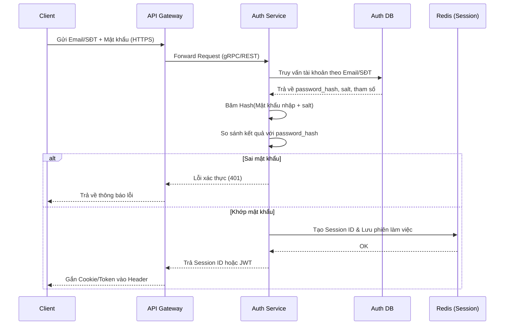
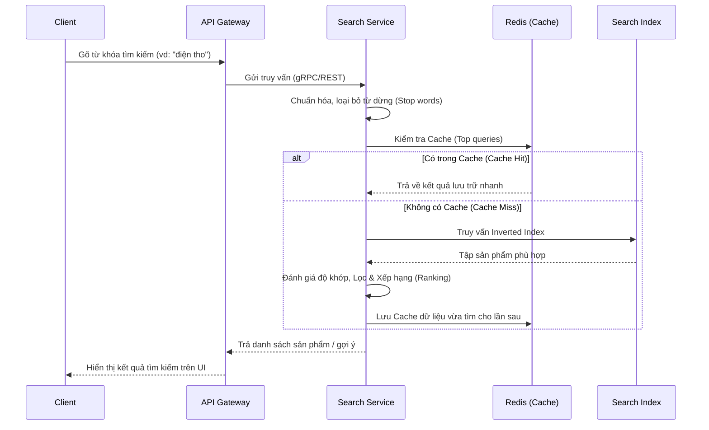

# Mô hình kiến trúc các service của Shopee

## 1. Tổng quan kiến trúc

**Các service bao gồm (Microservices):**
- **Gateway Service:** Điểm tiếp nhận request từ Client, làm nhiệm vụ router và load balancer.
- **Auth Service:** Cung cấp chức năng xác thực người dùng, cấp phát token/session.
- **Product Service:** Quản lý thông tin gốc của sản phẩm (CRUD).
- **Search Service:** Xây dựng, quản lý Inverted Index và xử lý các truy vấn tìm kiếm nhanh.

**Nguyên tắc chính của kiến trúc:**
- **Phân tán Data:** Mỗi service phụ trách một chức năng và sở hữu cơ sở dữ liệu riêng biệt. Service này không truy cập trực tiếp DB của service khác.
- **Giao tiếp đồng bộ (gRPC / HTTP):** Các luồng cần phản hồi tức thì (khách hàng đang chờ) như Gateway gọi sang Auth hoặc Search lấy kết quả, sẽ dùng **gRPC** để tối ưu hóa tốc độ và giảm độ trễ (latency).
- **Giao tiếp bất đồng bộ - EDA (Event-Driven Architecture):** Tách biệt các tác vụ nền. Thay vì Product gọi trực tiếp Search khi có dữ liệu mới, Product sẽ đẩy một sự kiện (Event) vào Kafka/RabbitMQ.

### 1.1. Bức tranh toàn cảnh (Visual Diagram)

Được vẽ theo cú pháp **Mermaid** để thể hiện rõ kiến trúc Microservice, gRPC đa dịch vụ và xử lý Event-driven.

```mermaid
flowchart TB
    %% Định nghĩa màu sắc & phong cách
    classDef client fill:#E2E8F0,stroke:#64748B,stroke-width:2px,color:#000;
    classDef gw fill:#FDE047,stroke:#CA8A04,stroke-width:2px,color:#000;
    classDef svc fill:#BFDBFE,stroke:#2563EB,stroke-width:2px,color:#000;
    classDef db fill:#BBF7D0,stroke:#16A34A,stroke-width:2px,color:#000;
    classDef cache fill:#FECACA,stroke:#DC2626,stroke-width:2px,color:#000;
    classDef event fill:#E9D5FF,stroke:#9333EA,stroke-width:2px,stroke-dasharray: 5 5,color:#000;

    Client(["Client (Web/Mobile)"]):::client
    Gateway{"API Gateway\n(Routing & Proxy)"}:::gw
    
    subgraph Microservices ["Cụm Microservices (Giao tiếp Nội bộ)"]
        AuthSvc["Auth Service\n(Xác thực & Session)"]:::svc
        SearchSvc["Search Service\n(Tìm kiếm & Gợi ý)"]:::svc
        ProductSvc["Product Service\n(Quản lý Sản phẩm)"]:::svc
    end

    subgraph EDA ["Event-Driven Architecture (EDA)"]
        Kafka[["Kafka / Message Broker"]]:::event
    end

    subgraph DataTier ["Databases & Caching Layer"]
        AuthDB[("Auth DB")]:::db
        ProductDB[("Product DB")]:::db
        SearchIdx[("Search Index")]:::db
        Redis[("Redis\n(Cache & Session)")]:::cache
    end

    %% Flow từ ngoài vào
    Client -- "HTTPS / REST" --> Gateway
    
    %% API Gateway điều hướng
    Gateway -- "gRPC / REST" --> AuthSvc
    Gateway -- "gRPC / REST" --> SearchSvc
    Gateway -- "gRPC / REST" --> ProductSvc

    %% Service kết nối Data
    AuthSvc -- "TCP" --> AuthDB
    AuthSvc -- "TCP Sync" --> Redis
    
    ProductSvc -- "TCP" --> ProductDB
    
    SearchSvc -- "TCP" --> SearchIdx
    SearchSvc -- "TCP Sync" --> Redis

    %% Publish/Subscribe luồng EDA
    ProductSvc -- "1. Publish Event\n(ProductChanged)" -.-> Kafka
    Kafka -. "2. Consume Event\n(Async Background)" .-> SearchSvc
```

### 1.2. Topology triển khai thực tế (High Availability & Scale-out)

Dựa trên kiến trúc HA (High Availability) tham khảo tiêu chuẩn, từng service ở trên sẽ được triển khai thực tế với mô hình dự phòng chặt chẽ ở mọi lớp (từ Load Balancer, Ứng dụng đến CSDL):

- **Lớp Edge (Nginx LB + Keepalived):** Requests từ Internet đi qua VIP (IP Ảo). Nginx-LB1 và Nginx-LB2 chạy chế độ Active/Passive Failover. Nginx sẽ giải mã TLS (TLS Termination) trước khi chuyển tiếp (route) request vào Gateway.
- **Lớp App Tier (Microservices):** Chuyên biệt hóa cho tính năng. Tất cả API Gateway, Auth, Product, Search đều thiết kế phi trạng thái (**Stateless**), dễ dàng mở rộng tự động (Scale ngang - auto scaling) thành nhiều Pod/Instance từ 1 đến N tùy tải lượng.
- **Lớp Data & Cache (Stateful):**
  - **Postgres HA (Patroni + etcd):** Cụm cơ sở dữ liệu Auth và Product dùng cấu hình 3 nodes: `PG-1 MASTER` (Đọc/Ghi chính), `PG-2 SYNC` (Đồng bộ tức thời - tránh mất dữ liệu), `PG-3 ASYNC` (Đồng bộ ngầm - dự phòng thảm họa).
  - **Redis Sentinel (3-node):** Cụm Cache/Session chạy `Redis-1` làm Master và `Redis-2`, `Redis-3` dự phòng failover tự động.
  - **Kafka Cluster:** Sử dụng tối thiểu cụm 3 Brokers để lưu trữ sự kiện EDA bền vững và có Replication phòng lỗi.



## 2. Đăng nhập và lưu mật khẩu

### 2.1. Lưu password_hash trong Auth DB
- **Auth Service** quản lý xác thực và lưu thông tin `password_hash` vào Auth DB (có kèm salt). Chỉ Auth service có thể truy cập
+ Không lưu mật khẩu thô, không mã hoá để giải mã ngược.
+ Dùng thuật toán băm 1 chiều, không thể dịch ngược về mật khẩu ban đầu
+ Mỗi mật khẩu cí 1 salt ngẫu nhiên riêng.

```text
Người dùng tạo mật khẩu
  -> HTTPS -> API Gateway -> Auth Service
  -> băm bằng thuật toán một chiều + salt riêng
  -> Auth DB: lưu password_hash, salt và tham số băm
```

### 2.2. Truy vấn tài khoản bằng email/số điện thoại
- Hệ thống dùng email hoặc số điện thoại (được lập chỉ mục) để tìm kiếm người dùng.
+ Auth service tìm bản ghi bằng email/số điện thoại
+ bản ghi trong đó có password_hash, salt và tham số băm

```text
Người dùng gửi email/số điện thoại + mật khẩu
  -> Gateway -> Auth Service
  -> Auth DB: tìm bản ghi bằng chỉ mục email/số điện thoại
  -> Lấy ra password_hash, salt, tham số băm
```

### 2.3. Băm và đối chiếu mật khẩu
- Khi có thông tin, hệ thống băm mật khẩu vừa nhận với salt đã lưu và đối chiếu với `password_hash` gốc.

```text
(Tiếp theo luồng trên)
  -> băm mật khẩu nhập vào với salt đã lưu
  -> so sánh với password_hash
```

### 2.4. Trả Session hoặc JWT
- Nếu xác thực thành công, hệ thống trả về Phiên (Session) hoặc Access Token (JWT).

```text
Xác thực thành công
  -> tạo Session ID và lưu phiên trong Redis
     hoặc ký access token JWT
  -> trả cookie/token cho ứng dụng
  -> các request sau gửi cookie/token để xác thực
```

**Luồng hoạt động đầy đủ (Sequence Diagram):**


## 3. Tìm kiếm và kết quả tức thì

### 3.1. Cập nhật dữ liệu và tạo Inverted Index
- **Product Service cập nhật dữ liệu:** Lưu sản phẩm gốc ở DB và phát sự kiện đồng bộ.
- **Search Service xây dựng Inverted Index:** Dùng chỉ mục đảo ngược để ánh xạ từ khóa với danh sách sản phẩm.

**Mô hình luồng cập nhật dữ liệu (EDA):**
```mermaid
sequenceDiagram
    participant ProdSvc as Product Service
    participant ProdDB as Product DB
    participant Kafka as Event Bus (Kafka)
    participant SearchSvc as Search Service
    participant Index as Search Index

    ProdSvc->>ProdDB: Lưu/Cập nhật sản phẩm gốc
    ProdDB-->>ProdSvc: OK
    ProdSvc-))Kafka: Publish Event (ProductChanged)
    Kafka-)SearchSvc: Consume Event (Bất đồng bộ)
    SearchSvc->>SearchSvc: Chuẩn hóa, Tách từ (Tokenize)
    SearchSvc->>Index: Cập nhật Inverted Index
    Index-->>SearchSvc: OK
```

### 3.2. Truy vấn, Cache và Xếp hạng
- **Client truy vấn Search Service:** khi người dùng đang nhập, Search Service tìm tiền tố trong Redis để trả gợi ý nhanh.
- **Redis xử lý cache/autocomplete:** Lấy kết quả lưu trữ nhanh cho các truy vấn phổ biến.
- **Search Index trả kết quả và xếp hạng:** Tìm tập hợp phù hợp nhất trong Index rồi xếp hạng, lọc.


- Trước khi tìm, hệ thống chuẩn hóa từ khóa, tách từ, bỏ từ dừng không cần thiết.
- Thay vì lưu “sản phẩm chứa những từ nào”, chỉ mục lưu “mỗi từ xuất hiện ở những sản phẩm nào”.
- Ví dụ: `áo -> [1, 5, 99]`, `thun -> [1, 2, 99]`, `nam -> [1, 3, 5]`.

**Mô hình luồng truy vấn (Autocomplete & Search):**


### 3.3. Hệ thống chọn và sắp xếp kết quả

- Search Index trước tiên tìm tập sản phẩm phù hợp, sau đó chọn nhóm kết quả tốt nhất cho trang đầu.
- Đánh giá mức độ khớp của từ khóa với tên, mô tả và thuộc tính sản phẩm.
- Loại sản phẩm không còn hiển thị hoặc không phù hợp bộ lọc; có thể ưu tiên sản phẩm còn hàng, đánh giá tốt hoặc gần khu vực người dùng.
- Sản phẩm quảng cáo có thể được ưu tiên theo chính sách.
- Dựa trên lịch sử xem/mua, khoảng giá, thương hiệu hoặc màu sắc người dùng thường quan tâm; phải tuân thủ quyền riêng tư.


## 4. Các service giao tiếp với nhau

| Luồng | Giao thức / Cơ chế | Mục đích |
| :--- | :--- | :--- |
| Client → Gateway | HTTPS / REST | Giao tiếp API vòng ngoài từ Backend for Frontend |
| Gateway → Auth/Search/Product | **gRPC** (Đồng bộ) | Giao tiếp nội bộ (Internal call) với định dạng Protobuf, độ trễ thấp |
| Product → Kafka → Search | **EDA / Kafka** (Bất đồng bộ) | Đẩy sự kiện có thay đổi sản phẩm để Search Index cập nhật nền, không làm chậm Product API |
| Auth / Search → Redis | TCP | Lưu trạng thái phiên làm việc và caching kết quả trả về tức thì |
| Search → Search Index | TCP | Trích xuất kết quả xếp hạng bằng thuật toán nội bộ |
| Auth → Client | Cookie/JWT | Đóng gói thông tin sau khi đăng nhập thành công |

---
