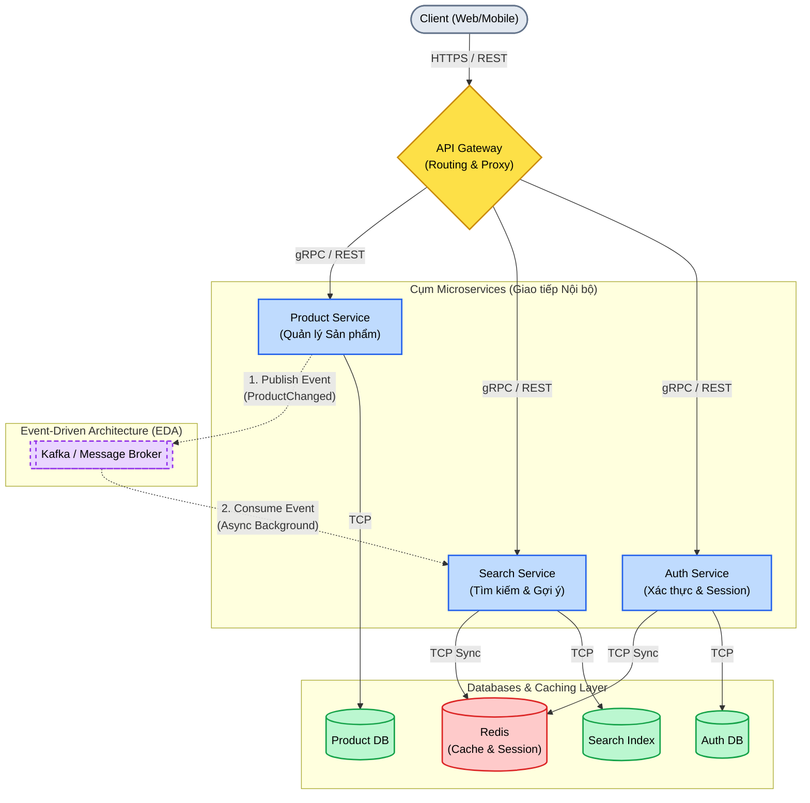
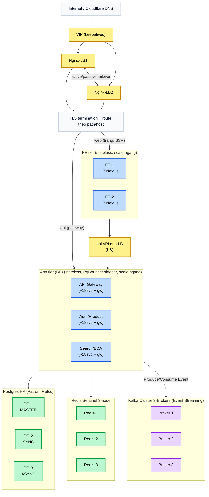
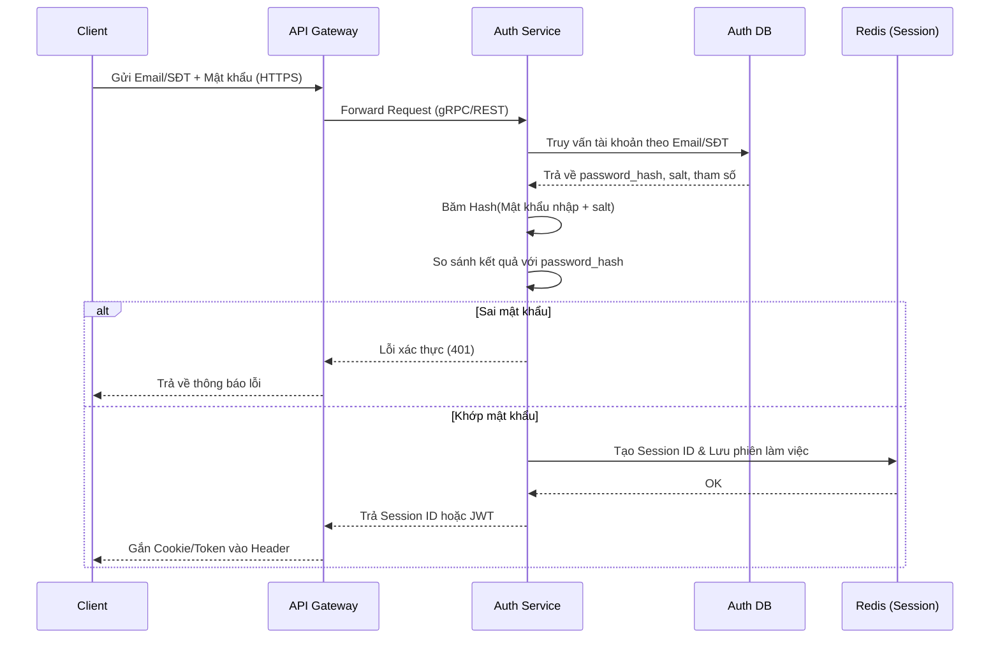
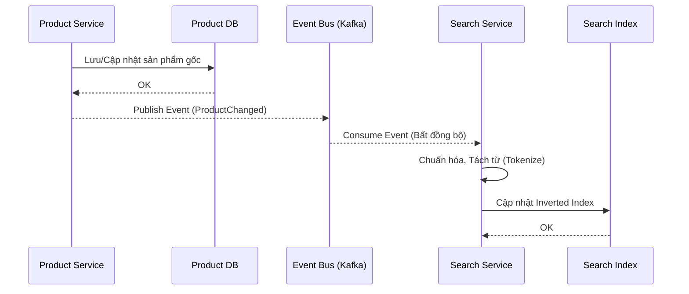
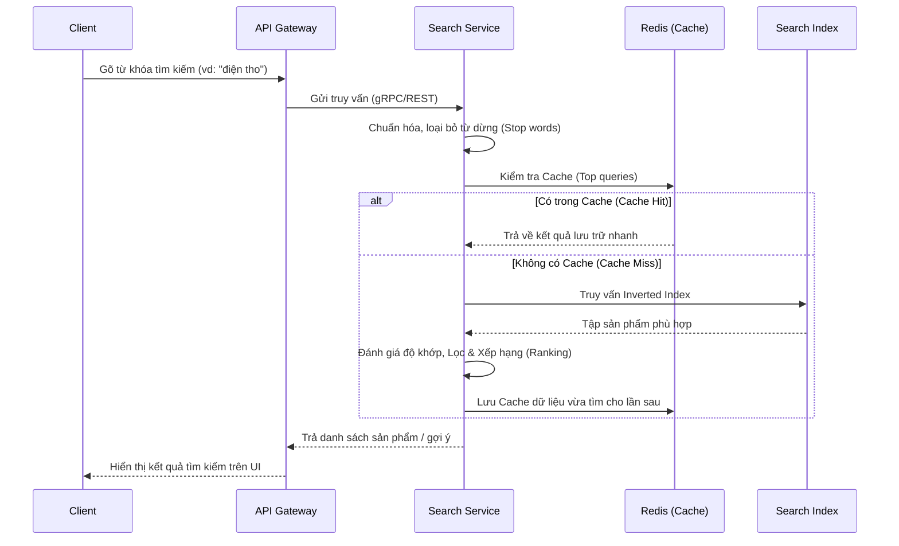

# Mô hình kiến trúc các service của Shoppee

## 1. Tổng quan kiến trúc

**Các service bao gồm (Microservices):**
- **Gateway Service:** Điểm tiếp nhận request từ Client, làm nhiệm vụ router và load balancer.
- **Auth Service:** Cung cấp chức năng xác thực người dùng, cấp phát token/session.
- **Product Service:** Quản lý thông tin gốc của sản phẩm (CRUD).
- **Search Service:** Xây dựng, quản lý Inverted Index và xử lý các truy vấn tìm kiếm nhanh.

**Nguyên tắc chính của kiến trúc:**
- **Phân tán Data:** Mỗi service phụ trách một chức năng và sở hữu cơ sở dữ liệu riêng biệt. Service này không truy cập trực tiếp DB của service khác.
- **Giao tiếp đồng bộ (gRPC / HTTP):** Các luồng cần phản hồi tức thì (khách hàng đang chờ) như Gateway gọi sang Auth hoặc Search lấy kết quả, sẽ dùng **gRPC** để tối ưu hóa tốc độ và giảm độ trễ.
- **Giao tiếp bất đồng bộ - EDA (Event-Driven Architecture):** Tách biệt các tác vụ nền. Thay vì Product gọi trực tiếp Search khi có dữ liệu mới, Product sẽ đẩy một sự kiện vào Kafka/RabbitMQ.

### 1.1. Overview map

- Kiến trúc Microservice, gRPC đa dịch vụ.

### 1.2. Topology thực tế 

- **Lớp Edge (DNS & Nginx LB):** Requests từ Internet đi qua VIP (IP Ảo qua Keepalived). Nginx-LB1 và Nginx-LB2 chạy chế độ Active/Passive Failover để làm TLS Termination rồi định tuyến.
- **Lớp FE Tier (Web / Trang SSR):** Nhánh Frontend gồm các node Next.js chạy giao diện (FE-1, FE-2), đặc tính là Stateless và Scale ngang. Sau đó chúng sẽ gọi API ngược qua một **Internal LB** để móc vào App Tier.
- **Lớp App Tier (Microservices Backend):** Nhánh Backend bao gồm Gateway, Auth, Product, Search. Các service này chạy Stateless, nhưng có điểm mấu chốt là **tích hợp PgBouncer Sidecar** đi kèm để tối ưu hóa pool kết nối vào CSDL.
- **Lớp Data Hierarchy (Phân mảnh theo HA):**
  - **Postgres HA (Patroni + etcd):** 3 nodes chính xác như tham chiếu: `PG-1 MASTER`, `PG-2 SYNC`, `PG-3 ASYNC`.
  - **Redis Sentinel 3-node:** Cụm node `Redis-1`, `Redis-2`, `Redis-3`.
  - **Kafka Cluster (Event Streaming):** Cụm 3 Broker xử lý giao tiếp bất đồng bộ, luân chuyển event an toàn không mất mát.

## 2. Đăng nhập và lưu mật khẩu

### 2.1. Đăng ký và Lưu mật khẩu
- **Auth Service** quản lý quá trình đăng ký và lưu trữ thông tin `password_hash` vào Auth DB (có đính kèm salt ngẫu nhiên). Chỉ có Auth Service mới được quyền truy cập dữ liệu này.
- **Quy tắc bảo mật:** Không lưu mật khẩu thô và không sử dụng mã hóa 2 chiều. Mật khẩu luôn được băm bằng thuật toán 1 chiều, không thể dịch ngược về nguyên bản.

### 2.2. Đăng nhập và Khởi tạo phiên làm việc
- **Truy vấn & Đối chiếu:** Khi người dùng đăng nhập, Gateway chuyển request về Auth Service. Hệ thống sẽ truy xuất bảng tài khoản (index theo email/SDT), lấy ra `salt` gốc để băm mật khẩu người dùng vừa nhập. Kết quả sau đó được so sánh với `password_hash` trong DB.
- **Cấp phát Session/JWT:** Nếu xác thực khớp 100%, hệ thống sẽ sinh một Session ID và lưu trữ phiên vào trong Redis; hoặc tạo ra Access Token (JWT) sau đó ghim vào kết quả trả về cho Client thực hiện các request nghiệp vụ kế tiếp.

**Luồng hoạt động đầy đủ:**

## 3. Tìm kiếm và kết quả tức thì

### 3.1. Cập nhật dữ liệu và tạo Inverted Index
- **Product Service cập nhật dữ liệu:** Lưu sản phẩm gốc ở DB và phát sự kiện đồng bộ.
- **Search Service xây dựng Inverted Index:** Dùng chỉ mục đảo ngược để ánh xạ từ khóa với danh sách sản phẩm.

**Mô hình luồng cập nhật dữ liệu (EDA):**

### 3.2. Truy vấn, Cache và Xếp hạng
- **Client truy vấn Search Service:** khi người dùng đang nhập, Search Service tìm tiền tố trong Redis để trả gợi ý nhanh.
- **Redis xử lý cache/autocomplete:** Lấy kết quả lưu trữ nhanh cho các truy vấn phổ biến.
- **Search Index trả kết quả và xếp hạng:** Tìm tập hợp phù hợp nhất trong Index rồi xếp hạng, lọc.

- Trước khi tìm, hệ thống chuẩn hóa từ khóa, tách từ, bỏ từ dừng không cần thiết.
- Thay vì lưu “sản phẩm chứa những từ nào”, chỉ mục lưu “mỗi từ xuất hiện ở những sản phẩm nào”.
- Ví dụ: `áo -> [1, 5, 99]`, `thun -> [1, 2, 99]`, `nam -> [1, 3, 5]`.

**Mô hình luồng truy vấn:**

### 3.3. Hệ thống chọn và sắp xếp kết quả

- Search Index trước tiên tìm tập sản phẩm phù hợp, sau đó chọn nhóm kết quả tốt nhất cho trang đầu.
- Đánh giá mức độ khớp của từ khóa với tên, mô tả và thuộc tính sản phẩm.
- Loại sản phẩm không còn hiển thị hoặc không phù hợp bộ lọc; có thể ưu tiên sản phẩm còn hàng, đánh giá tốt hoặc gần khu vực người dùng.
- Sản phẩm quảng cáo có thể được ưu tiên theo chính sách.
- Dựa trên lịch sử xem/mua, khoảng giá, thương hiệu hoặc màu sắc người dùng thường quan tâm; phải tuân thủ quyền riêng tư.

## 4. Các service giao tiếp với nhau

| Luồng | Giao thức / Cơ chế | Mục đích |
| :--- | :--- | :--- |
| Client → Gateway | HTTPS / REST | Giao tiếp API vòng ngoài từ Backend for Frontend |
| Gateway → Auth/Search/Product | **gRPC** (Đồng bộ) | Giao tiếp nội bộ (Internal call) với định dạng Protobuf, độ trễ thấp |
| Product → Kafka → Search | **EDA / Kafka** (Bất đồng bộ) | Đẩy sự kiện có thay đổi sản phẩm để Search Index cập nhật nền, không làm chậm Product API |
| Auth / Search → Redis | TCP | Lưu trạng thái phiên làm việc và caching kết quả trả về tức thì |
| Search → Search Index | TCP | Trích xuất kết quả xếp hạng bằng thuật toán nội bộ |
| Auth → Client | Cookie/JWT | Đóng gói thông tin sau khi đăng nhập thành công |

---
