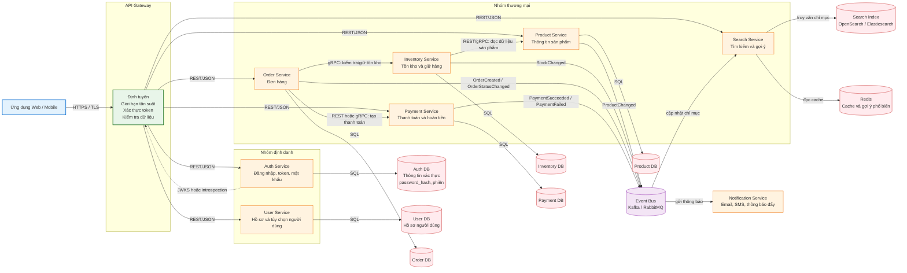

# Mô hình kiến trúc các service của Shopee

## 1. Tổng quan kiến trúc

Nguyên tắc chính:

- Mỗi service phụ trách một miền nghiệp vụ và sở hữu cơ sở dữ liệu của mình.
- Service khác không truy cập trực tiếp vào cơ sở dữ liệu của service đó; việc trao đổi phải đi qua API hoặc sự kiện.
- Luồng cần phản hồi ngay dùng HTTP/REST hoặc gRPC.
- Luồng có thể xử lý sau dùng hàng đợi sự kiện như Kafka hoặc RabbitMQ.
- API Gateway là cổng vào từ ứng dụng khách; không nên biến Gateway thành nơi chứa nghiệp vụ.



## 2. Đăng nhập và lưu mật khẩu

### Thành phần chịu trách nhiệm

- **Auth Service** quản lý thông tin xác thực: email/số điện thoại, `password_hash`, trạng thái tài khoản, phiên đăng nhập, refresh token và các nhà cung cấp OAuth.
- **User Service** chỉ quản lý hồ sơ nghiệp vụ như tên, địa chỉ, ảnh đại diện và tùy chọn. User Service không cần đọc bảng mật khẩu.
- **Auth DB** chỉ được Auth Service truy cập. Không đặt mật khẩu trong User DB, Order DB hoặc JWT.

### Cách lưu mật khẩu

Mật khẩu phải được băm một chiều bằng **Argon2id** (hoặc bcrypt nếu hệ thống chưa hỗ trợ Argon2id). Mỗi mật khẩu phải có salt riêng; có thể dùng thêm pepper lưu trong hệ thống quản lý bí mật.

```text
password_hash = Argon2id(password, salt, cost_parameters)
```

Không lưu mật khẩu dạng rõ, không mã hóa rồi lưu để giải mã lại, và không ghi mật khẩu vào log. Khi đăng nhập, Auth Service băm giá trị người dùng gửi lên với tham số/salt lưu trong bản ghi rồi dùng hàm so sánh an toàn với `password_hash`.

### Luồng đăng nhập

```text
Ứng dụng
  -> HTTPS -> API Gateway
  -> Auth Service: email/số điện thoại + mật khẩu
  -> Auth DB: lấy bản ghi xác thực theo chỉ mục duy nhất
  -> Auth Service: kiểm tra Argon2id/bcrypt, trạng thái tài khoản, MFA nếu có
  -> trả access token ngắn hạn + refresh token
```

Access token nên sống ngắn và được gửi trong cookie `HttpOnly`, `Secure`, `SameSite` hoặc cơ chế an toàn tương đương. Refresh token cần được lưu dạng băm, có thể thu hồi và xoay vòng. Gateway kiểm tra chữ ký/token; service nghiệp vụ vẫn phải kiểm tra quyền và chủ thể của yêu cầu, không chỉ tin vào Gateway.

JWT chỉ nên chứa định danh tối thiểu như `sub`, `role/scope`, `iat`, `exp`. JWT không phải nơi lưu mật khẩu hay dữ liệu hồ sơ lớn. Nếu dùng phiên trạng thái, lưu phiên/refresh token trong Redis hoặc Auth DB; Redis chỉ là kho phiên, không thay thế kho định danh lâu dài.

## 3. Tìm kiếm và hai cách trả kết quả tức thì

Không nên tìm kiếm trực tiếp bằng `LIKE '%từ_khóa%'` trên cơ sở dữ liệu giao dịch khi dữ liệu lớn. Cách phù hợp là Product Service phát sự kiện thay đổi, còn Search Service xây dựng một chỉ mục tìm kiếm riêng.

### Cách 1: gợi ý khi đang nhập (autocomplete)

```text
Người dùng gõ "điện tho"
  -> Gateway -> Search Service
  -> Redis hoặc chỉ mục dạng prefix/as-you-type
  -> trả về danh sách từ khóa, thương hiệu, danh mục, sản phẩm gợi ý
```

Nên đặt debounce khoảng 150–300 ms ở giao diện, giới hạn độ dài từ khóa và cache các tiền tố phổ biến. Kết quả có thể trả trong vài chục mili giây, nhưng đây là danh sách gợi ý chứ chưa phải trang kết quả đầy đủ.

### Cách 2: kết quả tìm kiếm đầy đủ

```text
Người dùng nhấn tìm kiếm
  -> Gateway -> Search Service
  -> OpenSearch/Elasticsearch: full-text, lọc, sắp xếp, phân trang
  -> trả danh sách sản phẩm, tổng số gần đúng, bộ lọc và điểm liên quan
```

Search Index có thể lập chỉ mục tên sản phẩm, mô tả, thương hiệu, danh mục và các thuộc tính được phép tìm. Giá/tồn kho thay đổi thường xuyên thì nên lấy từ nguồn phù hợp hoặc đồng bộ sự kiện có kiểm soát; không nên coi chỉ mục tìm kiếm là nguồn dữ liệu giao dịch cuối cùng.

### Có phải là “truy vấn ngược” không?

Không. Khi người dùng tìm kiếm, request vẫn đi theo chiều **Client → Gateway → Search Service → Search Index**. Search Service chủ động đọc chỉ mục để trả kết quả.

Việc **Product Service phát sự kiện → Search Service cập nhật chỉ mục** là đồng bộ dữ liệu một chiều, không phải truy vấn ngược. Chỉ mục là bản sao tối ưu cho việc đọc; dữ liệu sản phẩm chuẩn vẫn thuộc Product Service. Vì cập nhật chỉ mục có thể trễ vài mili giây hoặc vài giây, hệ thống phải chấp nhận tính nhất quán cuối cùng và có cơ chế retry/DLQ khi xử lý sự kiện lỗi.

## 4. Các service giao tiếp với nhau như thế nào?

### Giao tiếp đồng bộ

Dùng REST/JSON cho API dễ tích hợp hoặc gRPC/Protobuf cho giao tiếp nội bộ cần độ trễ thấp và hợp đồng kiểu dữ liệu rõ ràng.

- Order Service gọi Inventory Service để kiểm tra và giữ tồn kho trước khi xác nhận đơn.
- Order Service gọi Payment Service để tạo yêu cầu thanh toán.
- Inventory Service chỉ gọi Product Service khi cần dữ liệu sản phẩm; không đọc Product DB trực tiếp.
- Mọi lời gọi phải có deadline/timeout, retry có giới hạn, idempotency key và Circuit Breaker phù hợp.

### Giao tiếp bất đồng bộ

Service phát sự kiện lên Event Bus rồi tiếp tục xử lý. Consumer nhận sự kiện và thực hiện công việc riêng.

- `ProductChanged`: Search Service cập nhật chỉ mục.
- `StockChanged`: Search Service cập nhật thông tin hiển thị nếu cần.
- `OrderCreated`, `OrderStatusChanged`: Notification Service gửi thông báo.
- `PaymentSucceeded`, `PaymentFailed`: Order Service cập nhật trạng thái đơn thông qua consumer, có khóa chống xử lý trùng.

Sự kiện nên có `event_id`, `event_type`, `occurred_at`, `aggregate_id`, `version` và `trace_id`. Producer nên dùng Transactional Outbox để tránh trường hợp ghi cơ sở dữ liệu thành công nhưng phát sự kiện thất bại. Consumer phải idempotent và có dead-letter queue.

## 5. Luồng nghiệp vụ mẫu

### Tạo đơn

```text
Client -> Gateway -> Order Service
Order Service -> Inventory Service: giữ hàng (gRPC, đồng bộ)
Order Service -> Payment Service: tạo thanh toán (REST/gRPC, đồng bộ)
Order Service -> Order DB: lưu đơn ở trạng thái chờ thanh toán
Order Service -> Event Bus: OrderCreated
Event Bus -> Notification Service: thông báo cho người dùng
```

Nếu một bước sau thất bại, dùng Saga và các hành động bù trừ, ví dụ hủy giữ hàng hoặc hoàn tiền. Không cố dùng một giao dịch SQL chung cho nhiều service.

### Cập nhật sản phẩm và tìm kiếm

```text
Product Service -> Product DB: cập nhật sản phẩm
Product Service -> Event Bus: ProductChanged
Event Bus -> Search Service: lập chỉ mục lại sản phẩm
Search Service -> Search Index: ghi tài liệu tìm kiếm
```

## 6. Kiểm tra nhanh mô hình

- Auth Service là nơi duy nhất kiểm tra mật khẩu và sở hữu dữ liệu xác thực.
- Mật khẩu được băm bằng Argon2id/bcrypt, có salt riêng; không lưu trong JWT hoặc log.
- Product DB và Search Index tách biệt; Search Index chỉ là bản sao tối ưu cho truy vấn.
- Autocomplete và tìm kiếm đầy đủ là hai API/cách xử lý khác nhau nhưng cùng thuộc Search Service.
- Gọi cần phản hồi ngay dùng REST/gRPC; công việc phát sinh sau dùng Event Bus.
- Không có service nào truy cập trực tiếp DB của service khác.
- Có timeout, retry có kiểm soát, idempotency, Circuit Breaker, trace ID và cơ chế xử lý sự kiện lỗi.

## 7. Bảng giao thức

| Giao thức | Mục đích | Đặc điểm |
|---|---|---|
| HTTPS/REST | Client gọi Gateway và API công khai | Dễ tích hợp, dùng JSON |
| gRPC | Gọi nội bộ cần phản hồi nhanh | Protobuf, kiểu dữ liệu rõ, độ trễ thấp |
| WebSocket/SSE | Cập nhật trạng thái đơn hoặc thanh toán | Kênh cập nhật gần thời gian thực |
| Kafka/RabbitMQ | Phát sự kiện và xử lý bất đồng bộ | Tách rời producer/consumer, có thể retry |
| Redis | Cache, phiên, gợi ý phổ biến | Không thay thế dữ liệu bền vững |
| OpenSearch/Elasticsearch | Tìm kiếm toàn văn và lọc | Chỉ mục đọc nhanh, nhất quán cuối cùng |
